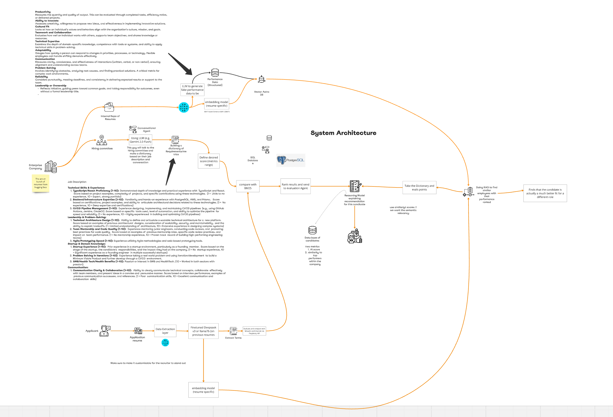

# Hire Quality

## Description

The Core Problem
The current recruitment process is broken on both sides:
For recruiters: Traditional systems rely on keyword matching, which surfaces candidates who are good at optimizing their resumes but may not be truly qualified. Recruiters waste time interviewing candidates who "look good on paper" but don't perform well.
For candidates: Qualified candidates get overlooked because they don't have the exact keywords or prestigious educational backgrounds, even if they have the right skills and potential.
Your Solution
Your system solves this by:
Moving beyond keywords to understand the semantic meaning of resumes and job requirements
Finding candidates similar to proven top performers rather than just matching against generic requirements
Providing intelligent reasoning about why a particular candidate might succeed, beyond just a similarity score
Balancing both formal requirements and performance potential through your dual-metric approach
The key innovation is combining data about who has actually succeeded in the role with traditional requirement matching. This addresses the fundamental disconnect in recruiting where job descriptions often don't accurately predict who will perform well.
This is valuable because it:
Reduces time-to-hire (efficiency gain)
Improves quality-of-hire (performance gain)
Potentially increases diversity by looking beyond traditional signals
Provides more objective evaluation criteria
So while similarity with top performers is one component, the complete solution is about creating a more intelligent, performance-based recruiting system that better matches candidates to roles where they'll succeed.

Core MVP Features
Resume Processing

Use Unstructured to parse resumes in various formats (PDF, Word, HTML)
Extract structured information from resumes (experience, skills, education)
Generate one vector embedding per resume initially (simplify for MVP)
Store in Astra DB with associated performance metadata
Performance Metrics Generation

Use LLM to generate synthetic performance data for sample employees
Include 4-5 key metrics:
Cultural fit (1-10 scale)
Teamwork/collaboration (1-10 scale)
Technical expertise (1-10 scale)
Problem-solving ability (1-10 scale)
Reliability (1-10 scale)
Job Requirements Processing

Conversational agent interface for hiring managers
Use Gemini 2.0 Flash to extract structured requirements from conversations
Build dictionary of requirements with weighted importance
Candidate Evaluation

Compare applicant resumes to existing employee resumes using vector similarity
Evaluate against job requirements using BM25 algorithm
Generate two key scores:
AI score (match to job requirements)
Similarity to top performers (with predicted performance based on similar employees)
Reasoning Agent

Implement in Langflow as central decision-making component
Combine both similarity and requirements scores to make final recommendations
Provide explainable reasoning for why a candidate is recommended
Suggest alternative roles if candidate is a poor fit for current position
Dashboard UI

Candidate ranking list with dual metrics (AI score and similarity percentage)
Display most similar internal employees for each candidate
Performance prediction visualization showing expected scores across metrics
Simple filters for sorting and viewing candidates
Demo Setup

Create 10-15 sample employee resumes with performance data
Generate 5-10 applicant resumes to demonstrate the system
Set up 2-3 different job roles for variety
Technical Implementation
Use Langflow for building the agent workflow visually
Implement Unstructured for data processing
Use DataStax Astra DB for vector storage
Implement a simple front-end visualization
Use synthetic data for demonstration purposes
This MVP balances technical feasibility for a hackathon timeframe while demonstrating the core value proposition: using existing employee performance data to predict candidate success, rather than relying solely on keyword matching.

For an MVP in a hackathon setting, using one vector per resume is a good starting point, but it does come with limitations.
Benefits of Single Vector Approach
Simplicity - Much easier to implement quickly
Less computational overhead - Faster processing and retrieval
Clearer demonstration - More straightforward to explain the concept
Simpler vector database setup - Less complex schema and queries
Limitations to Consider
Loss of Section-Specific Context - A resume has distinct sections (education, experience, skills) that might be better represented separately
Diluted Relevance - Important skills or experiences might get "averaged out" in a single vector
Less Granular Matching - You can't specifically match on just work experience or just education
Limited Query Flexibility - Your similarity search is all-or-nothing rather than targeted
Recommendation
For the hackathon MVP, start with the single vector approach to get a working system faster. You can mention in your presentation that a production version would use a more sophisticated multi-vector approach.
If you have time after implementing the core functionality, you could enhance the system by:
Using Unstructured to separate resumes into logical sections
Creating separate vectors for:
Work experience
Education
Skills and certifications
Projects
This would allow for more nuanced matching (e.g., "This candidate's work experience is similar to our top performers, even though their educational background is different").

## Assets

[all resumes zip, Google Drive](https://drive.google.com/file/d/1SHSUe24cNs9IYm9qofH90NehbrE0-6vI/view?usp=drive_link)

[source](https://www.kaggle.com/datasets/snehaanbhawal/resume-dataset)
